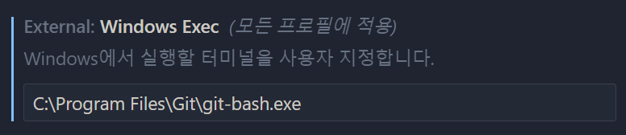
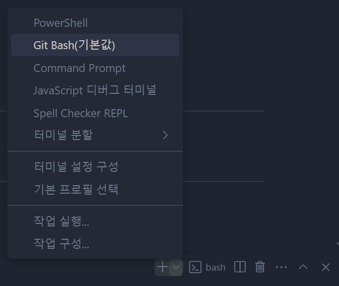
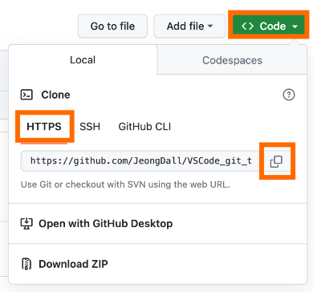
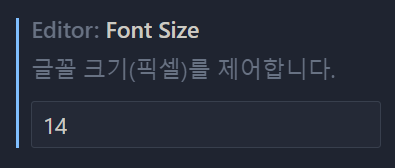
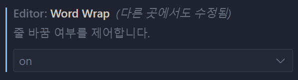
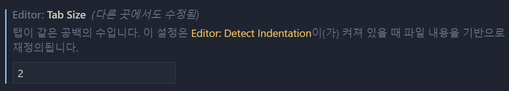
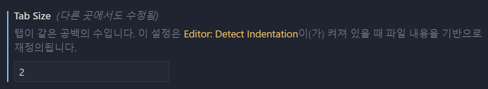
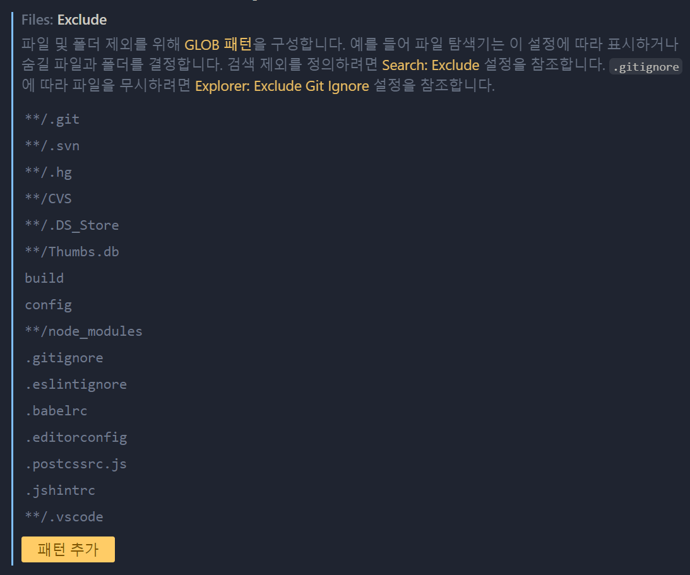

[[TOC]]
<br><br>

# Git 동기화 설정

<br>

## git bash 설정

1. VS Code 명령 프롬프트(Terminal) Git Bash로 기본 설정
<br> 

2. VS Code 터미널 실행 후 bash로 기본 값 설정
<br> 


## github 연동

1. Git 사용자 이름 설정
      ````bash
        git config --global user.email "YOUR_EMAIL"
      ````

2. Git 사용자 이름 설정
      ````bash
        git config --global user.name "YOUR_NAME"
      ````

3. Github에 New Repository 생성 후 git HTTPS 복사
      ````bash
        git clone "HTTPS_LINK"
      ````
    

4. git 플러그인 아이콘 클릭 후 연동 확인

<br><br>

# VS Code 개발 환경 설정

<br>

## Edit 기본 설정

<br>

- 폰트 사이즈 설정
<br> 
- 에디터 줄바꿈 처리
<br> 
- 코드 들여쓰기 설정
<br> 
<br> 
- 동기화 예외 처리 (.gitignore)
<br> 

<br>

## 유용한 플러그인 설치

- [Auto Complete Tag](https://marketplace.visualstudio.com/items?itemName=formulahendry.auto-complete-tag) - 마크업 자동 생성
- [Ayu](https://marketplace.visualstudio.com/items?itemName=teabyii.ayu) - 마크업 색 테마 설정
- [Bracket Pair Colorization Toggler](https://marketplace.visualstudio.com/items?itemName=dzhavat.bracket-pair-toggler) - Bracket Pair 색상 설정
- [className Completion in CSS](https://marketplace.visualstudio.com/items?itemName=zitup.classnametocss) - html, css 연결 class명 힌트
- [htmltagwrap](https://marketplace.visualstudio.com/items?itemName=bradgashler.htmltagwrap) - html tag 랩핑
- [GitHub Copilot Chat](https://marketplace.visualstudio.com/items?itemName=GitHub.copilot-chat) - ChatGPT처럼 Chat 프롬포트 활용
- [html-entities](https://marketplace.visualstudio.com/items?itemName=christopherstyles.html-entities) - 엔티티코드로 변환
- [Git Graph](https://marketplace.visualstudio.com/items?itemName=mhutchie.git-graph) - github 버전 관리
- [Git History](https://marketplace.visualstudio.com/items?itemName=donjayamanne.githistory) - github 히스토리 관리
- [Image preview](https://marketplace.visualstudio.com/items?itemName=kisstkondoros.vscode-gutter-preview) - 이미지 미리보기
- [indent-rainbow](https://marketplace.visualstudio.com/items?itemName=oderwat.indent-rainbow) - 들여쓰기 라인 색설정

<br><br>

# 마크다운 문법 활용

<br>

## 자주쓰는 마크다운 작성 방법
| README.md 파일은 마크다운 문법으로 작성 합니다.

### 1. h1 ~ h4 제목

<br>

# H1 제목 크기
````
h1 Tab or # (기호)
````
## H2 제목 크기
````
h2 Tab or ## (기호)
````
### H3 제목 크기
````
h3 Tab or ## (기호)
````
#### H4 제목 크기
````
h4 Tab or ## (기호)
````

### 2. 순번 & 기호 리스트

<br>

1. 순번 리스트
   1. 하위 리스트 01
   1. 하위 리스트 02
1. 순번 리스트
   1. 하위 리스트 01
   1. 하위 리스트 02

  ````
  1.
    1.
    1.
  1.
    1.
    1.
  ````

- 기호 리스트
  - 하위 리스트 01
  - 하위 리스트 02
    - 하위 리스트 01
    - 하위 리스트 02
- 기호 리스트
  - 하위 리스트 01
  - 하위 리스트 02

  ````
  -
    -
    -
      -
      -
  -
    -
    -
  ````

### 3. 링크 및 이미지

<br>

- 링크 삽입하기
  ````
  [링크 제목 작성](링크 삽입)
  ````

- 이미지 삽입하기
  ````markdown
  
  ````

### 4. 글자 Bold

<br>

- 글자 **두껍게** 처리
  ````
  글자 드래그 후 ctrl + b or ** 글자 작성 **
  ````

### 4. 코드 작성

<br>

- 짧은 코드 `markup` 작성
  ````
  글자 드래그 후 `(백틱) Tab 키 위 버튼
  ````

- 긴 코드 작성
  ````html
  <html></html>

  <!-- ````html 작성 -->
  ````

  ````css
  .style {
    color: skyblue;
  }

  /* ````css */
  ````

  ````js
  console.log('test');

  /* ````js */
  ````

<br><br>

## 유용한 마크다운 플러그인

- 마크다운 문법 자동 생성 - [Markdown All in One](https://marketplace.visualstudio.com/items?itemName=yzhang.markdown-all-in-one)
- 마크다운 문법 미리 보기 [Markdown Preview Mermaid Support](https://marketplace.visualstudio.com/items?itemName=bierner.markdown-mermaid)